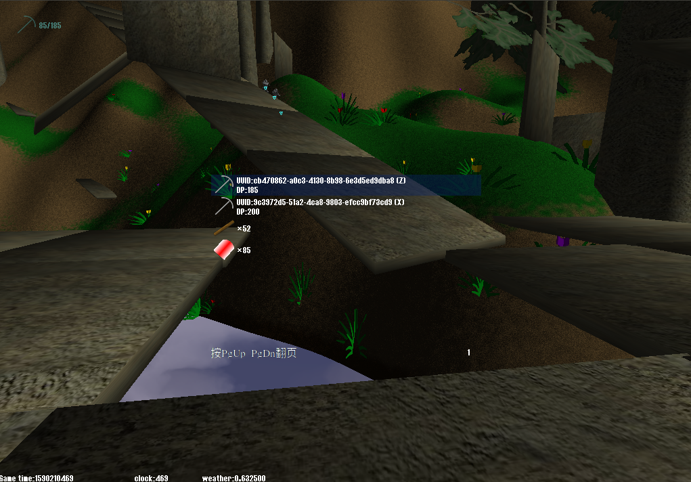

# Smoothly  
这是一个第一人称策略型沙盒游戏，使用qt开发，图形基于irrlicht，物理基于bullet，网络基于raknet，数据库基于leveldb。  
[点击查看视频演示](https://www.bilibili.com/video/BV1HA411h78b/)  
  
  
  
  
  
## 编译  
在编译前，请先安装qt,bullet,raknet,leveldb，然后进入src目录，执行`qmake && make`即可  
irrlicht请通过git子模块的方式来安装。本项目使用了修改过的[irrlicht](https://github.com/SingingRivulet/splicht)，与原引擎不兼容。  
## 使用  
服务器端直接运行即可。管理员客户端和游戏客户端均具有GUI界面。  
## 按键操作  
`w`/`a`/`s`/`d` 控制移动  
`空格` 跳跃  
`鼠标左键` 开火  
`转轮` 换枪  
`e` 拾取物品，接取任务  
`r` 装弹  
`g` 丢弃物品  
`t` 建造  
`h` 选择单位（双击全选）  
`y` 设置移动目标  
`l` 切换视角至选中的单位上  
`;` 打开科技系统  
`tab` 打开背包  
`n` 查看邮件  
`p` 扫描地图  
`m` 打开地图  
`esc` 打开菜单  
## 地图占领  
打开地图界面后，可按`F9`占领区块，占领后可设置权限或添加任务  
### 任务系统  
本游戏将任务编辑权限开放给所有用户。操作方法：  
占领区块后，按`F10`在当前坐标添加任务节点（只有管理员才有权限设置任务奖励和消耗，设置奖励和消耗需要使用gui-admin）  
## 命令  
按`esc`后可输入命令  
### 常用命令：  
`mail pickup [UUID]` 领取礼包码  
`mission goParent` 任务后退  
`mission remove [UUID]` 删除任务（需要作者才能操作，管理员请使用gui-admin）  
