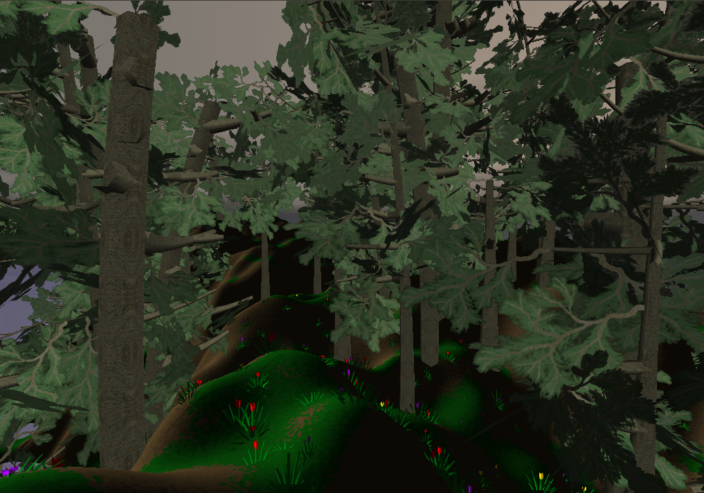
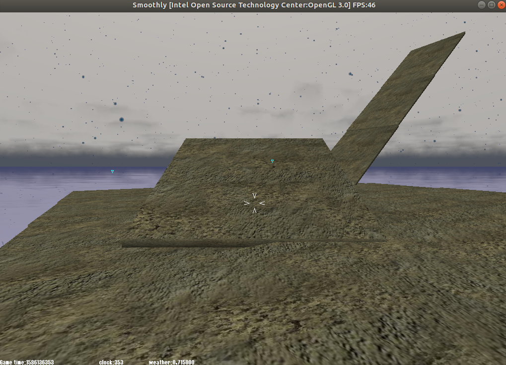
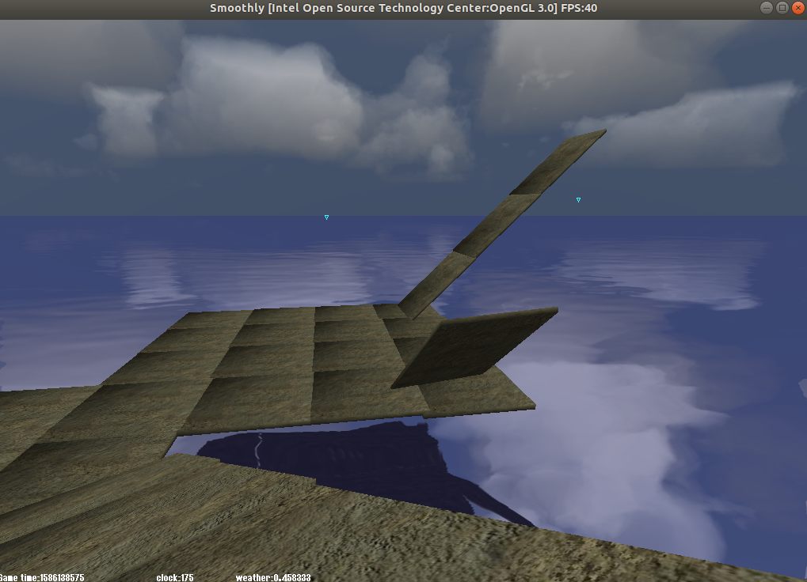
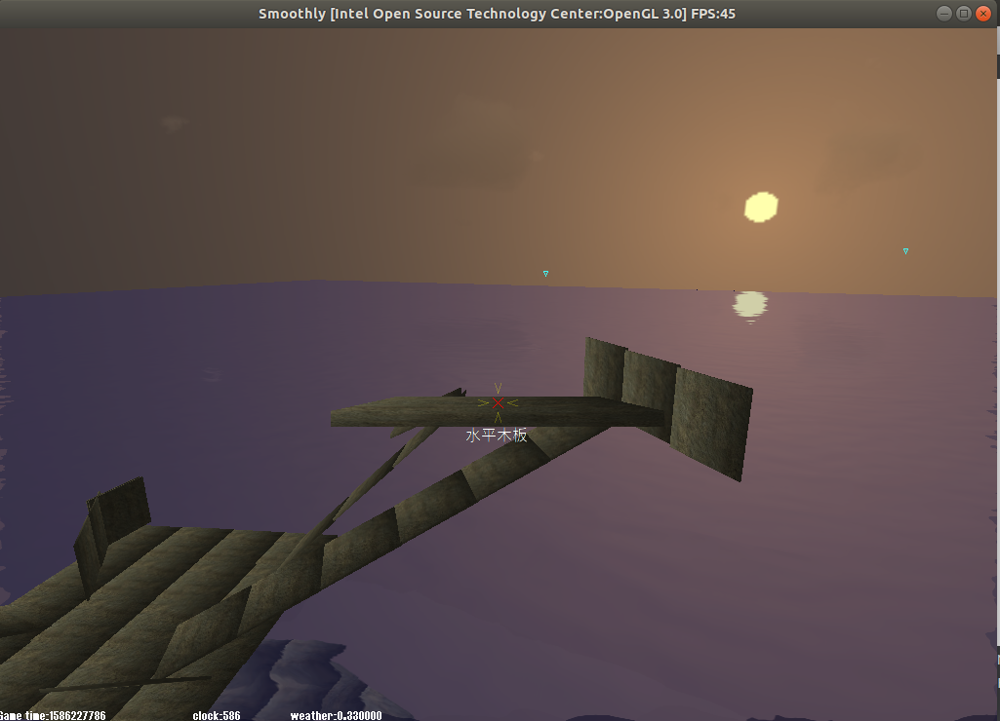

# Smoothly  
这是一个第一人称策略型沙盒游戏，使用qt开发，图形基于irrlicht，物理基于bullet，网络基于raknet，数据库基于leveldb。  
[点击查看视频演示](https://www.bilibili.com/video/BV1HA411h78b/)  
  
  
  
  
## 编译  
在编译前，请先安装qt,irrlicht,bullet,raknet,leveldb，然后进入src目录，执行`qmake && make`即可  
## 使用  
服务器端直接运行即可。管理员客户端和游戏客户端均具有GUI界面。  
## 计划（按时间顺序）  
- 随机地图（已完成）  
- 联机（已完成）  
- 场景破坏（已完成）  
- 建筑系统（已完成）  
- 骨骼动画（已完成）  
- 装备系统（已完成）  
- 多人单挑对战（已完成）  
- 多人指挥对战  
- 分布式副本编辑器(见[sinriv.com](https://sinriv.com))  
