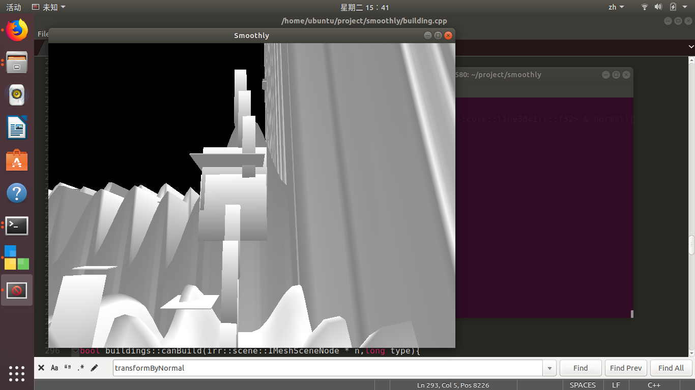

# Smoothly  
Smoothly，中文名 平静之地，这是一款可以建造房子的开源游戏  
# 使用方法：  
## 安装：  
先安装irrlicht，bullet3，raknet，然后使用 `make server`编译服务器，`make client` 编译客户端，然后先运行服务器，再运行客户端  
## 操作：  
wasd控制移动，ctrl下降，空格上升，zxcv切换建筑类型，鼠标右键建造  
## 效果图：  
  
  
  
  